<div align="center">

# Headroom

Simulate a local AI box under your own crowd: pick the hardware, a model and the users, then find the redline before you buy

[![Live][badge-site]][url-site]
[![HTML5][badge-html]][url-html]
[![CSS3][badge-css]][url-css]
[![JavaScript][badge-js]][url-js]
[![Claude Code][badge-claude]][url-claude]
[![License][badge-license]](LICENSE)

[badge-site]:    https://img.shields.io/badge/live_site-0063e5?style=for-the-badge&logo=googlechrome&logoColor=white
[badge-html]:    https://img.shields.io/badge/HTML5-E34F26?style=for-the-badge&logo=html5&logoColor=white
[badge-css]:     https://img.shields.io/badge/CSS3-1572B6?style=for-the-badge&logo=css3&logoColor=white
[badge-js]:      https://img.shields.io/badge/JavaScript-F7DF1E?style=for-the-badge&logo=javascript&logoColor=black
[badge-claude]:  https://img.shields.io/badge/Claude_Code-CC785C?style=for-the-badge&logo=anthropic&logoColor=white
[badge-license]: https://img.shields.io/badge/license-MIT-404040?style=for-the-badge

[url-site]:   https://headroom.neorgon.com/
[url-html]:   #
[url-css]:    #
[url-js]:     #
[url-claude]: https://claude.ai/code

</div>

---

## Overview

Headroom tells you whether a local AI box will serve your people before you pay for it. Pick a box (DGX Spark, Ryzen AI Halo, Mac Studio, Jetson Thor, an RTX workstation or your own specs), a model, a server and a crowd, such as 50 Kindle readers on Wi-Fi, six coding agents on a LAN or hikers on a LoRa mesh. It simulates every request from the first byte on the wire to the last e-ink refresh. The answer is a verdict (overloaded, tight, right-sized or overkill), the thing that runs out first, and the redline: how many users the setup holds.

**Live:** headroom.neorgon.com

---

## Features

- **Sandbox** -- a live floor of users around the box, colored by what they are doing, with throughput, queue, answers-on-target and power charts
- **Find the redline** -- doubles the crowd until answers fail, then bisects; when the network gives out first, it also reports what the box alone would hold
- **Compare boxes** -- the same crowd on every box in the catalog, with redlines, cost per user and wall power
- **Missions** -- nine scenarios with a budget and a par price; three stars for serving everyone on the cheapest hardware that works
- **Real protocols and links** -- SSE per-token events vs WebSocket batches, Wi-Fi airtime, Bluetooth hub limits, LoRa duty cycles, VPN distance
- **Two server designs** -- llama.cpp and Ollama slots with preallocated context, vLLM, SGLang and TensorRT-LLM paged KV with prefix caching
- **Calibrated, and shows its work** -- published benchmarks next to the model's predictions, typical error about 11%
- **Costs** -- electricity, amortization and payback against the same tokens from a cloud API
- **Shareable** -- one link reproduces the exact scenario; everything runs in the browser

---

## Running locally

ES modules require an HTTP server (not `file://`):

```bash
make serve
```

Or manually:

```bash
python3 -m http.server 8894
```

The engine is plain ES modules with no DOM, so it also runs headless in Node:

```bash
node --input-type=module -e "import('./js/engine/sim.js').then(m => console.log(m.runScenario({box:{id:'dgx-spark',count:1},model:{id:'gpt-oss-120b',quant:'mxfp4',kv:'f16'},runtime:{id:'vllm'},groups:[{persona:'reader',count:50,client:'kindle',link:'wifi',distanceKm:0.015}]}).verdict))"
```

---

## Architecture



```
headroom-site/
├── index.html              # App shell: sandbox, missions, compare, method prose
├── css/
│   ├── style.css           # Fleet template plus the app layout and chart tokens
│   └── viz.css             # Viz Kit (vendored)
├── js/
│   ├── app.js              # Entry point
│   ├── state.js            # Scenario, persistence, shareable links
│   ├── runner.js           # Live animation loop and Web Worker jobs
│   ├── render.js           # Top-level rendering per tab
│   ├── events.js           # Every listener, delegated
│   ├── utils.js            # Formatting helpers
│   ├── viz.js              # Viz Kit (vendored)
│   ├── engine/             # Pure simulation, no DOM
│   │   ├── perf.js         # Roofline model: memory fit, step time, MoE routing
│   │   ├── server.js       # Continuous batching, slots vs paged KV, prefix cache
│   │   ├── network.js      # Links as airtime queues, protocols, distance
│   │   ├── sim.js          # Discrete-event simulation of the crowd
│   │   ├── report.js       # Verdict, bottleneck, advice, economics
│   │   ├── batch.js        # Redline search and box comparison
│   │   ├── worker.js       # Runs batch jobs off the main thread
│   │   ├── heap.js         # Event queue
│   │   └── rng.js          # Seeded randomness
│   ├── data/               # Hardware, models, runtimes, crowd, missions, calibration
│   └── ui/                 # Loadout, floor canvas, scoreboard, charts, compare, missions, method
├── docs/
│   ├── architecture.mmd    # Diagram source
│   └── research.md         # Sourced specs and benchmarks behind the catalog
├── robots.txt
├── sitemap.xml
├── CNAME
└── Makefile
```

---

<div align="center">
<sub>Part of <a href="https://neorgon.com/">Neorgon</a></sub>
</div>
